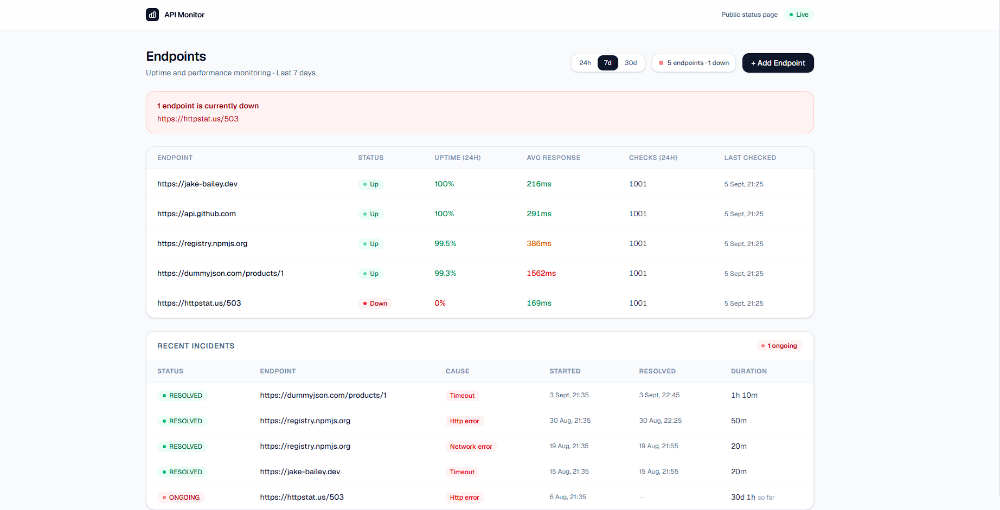
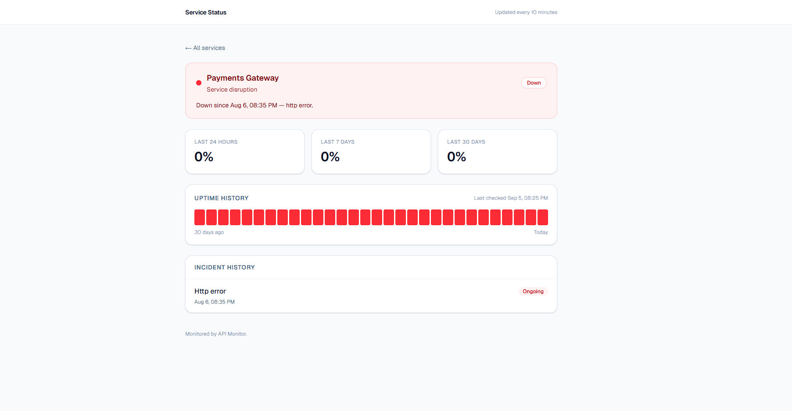

# API Monitor

**Know your site is down before your customers tell you.**

If your booking form stops taking bookings at 2am, how long until you find out?
For most small businesses the answer is "when someone complains" — which is
usually after they have given up and gone elsewhere.

API Monitor checks your website and APIs every few minutes, keeps a record of
every check, and emails you the moment something breaks — and again when it
recovers. It also gives you a public status page you can send to customers
instead of fielding "is it just me?" messages.



## What it does

**Tells you when something breaks.** Failed checks are grouped into incidents
with a start, an end and a cause, so a two-hour outage is one incident rather
than twelve separate alarms. You get one email when it goes down and one when it
comes back — not one per failed check.

**Shows you what "normal" looks like.** Response times are tracked over 24
hours, 7 days and 30 days. Services rarely fail without warning; they get slower
first. Watching that trend is how you fix a problem before it becomes an outage.

**Gives your customers somewhere to look.** Each monitored service gets a public
status page — uptime figures, a bar per day of history, and an incident log — on
a shareable URL with no login. Nothing is public unless you publish it.

**Distinguishes kinds of failure.** A timeout, an expired TLS certificate, a DNS
failure and a 500 are different problems with different fixes, and are recorded
as such.



## Live demo

|                    |                    |
| ------------------ | ------------------ |
| Dashboard          | _not yet deployed_ |
| Public status page | _not yet deployed_ |

The demo monitors real public APIs, so what you see is live rather than
fixtures, alongside 30 days of seeded history so the charts have something to
show. One endpoint is deliberately pointed at a URL that always returns an
error, so there is always an open incident to look at.

**On honesty about limits:** checks run on a scheduled job every 10 minutes, and
that scheduler is best-effort — it can run late when the platform is busy. That
is fine for a demonstration. A production monitoring service you were paying for
would run checks from several regions on a guaranteed schedule, and this does
not pretend to.

## Running it locally

You need Docker.

```bash
git clone https://github.com/Bailsby/api-monitoring-saas.git
cd api-monitoring-saas
docker compose up
```

That starts the API, the dashboard, the worker and Postgres together.

- Dashboard — http://localhost:3001
- Public status pages — http://localhost:3001/status
- API — http://localhost:3000

Then set up the database and load the demo data:

```bash
cd apps/api
npx prisma migrate deploy
npm run seed
```

Alerting stays switched off until you add a Resend API key — see
[`apps/api/.env.example`](apps/api/.env.example). Everything else works without
it.

## Deploying

See [DEPLOYMENT.md](DEPLOYMENT.md). It runs entirely on free tiers: Vercel for
the dashboard, Render for the API, Neon or Supabase for Postgres, and GitHub
Actions as the scheduler.

## How it is built

A monorepo with two applications and a scheduled worker.

|           |                                                 |
| --------- | ----------------------------------------------- |
| API       | Fastify, TypeScript                             |
| Database  | PostgreSQL via Prisma                           |
| Dashboard | Next.js (App Router), React, Tailwind, Recharts |
| Worker    | Standalone TypeScript script, run by cron       |
| Tests     | Vitest                                          |
| Email     | Resend                                          |

**The worker runs once and exits** rather than looping forever. Scheduling is
external — GitHub Actions in production, Compose locally. That removes the need
for an always-on process, makes each run independently observable, and means the
same schedule can keep the free-tier API warm.

**Incident logic is a pure function** ([`incidents.service.ts`](apps/api/src/services/incidents.service.ts)).
Deciding whether an outage has started is the part most worth getting right, so
it is separated from the database and tested exhaustively. The seed script
replays generated checks through that same function, so demo history and real
history are produced by identical rules.

### Repository layout

```
apps/
  api/           Fastify API, worker, Prisma schema and migrations
    prisma/      Schema, migrations, demo seed
    src/
      jobs/      The check-and-reconcile run
      routes/    HTTP endpoints
      services/  Incident, alert, stats and status logic
  web/           Next.js dashboard and public status pages
.github/
  workflows/     Scheduled checks, and CI
```

### Development

```bash
cd apps/api
npm run lint
npm test
npm run worker      # run one pass of checks against the configured endpoints
```

Tests, lint and typecheck run in CI on every push and pull request.
